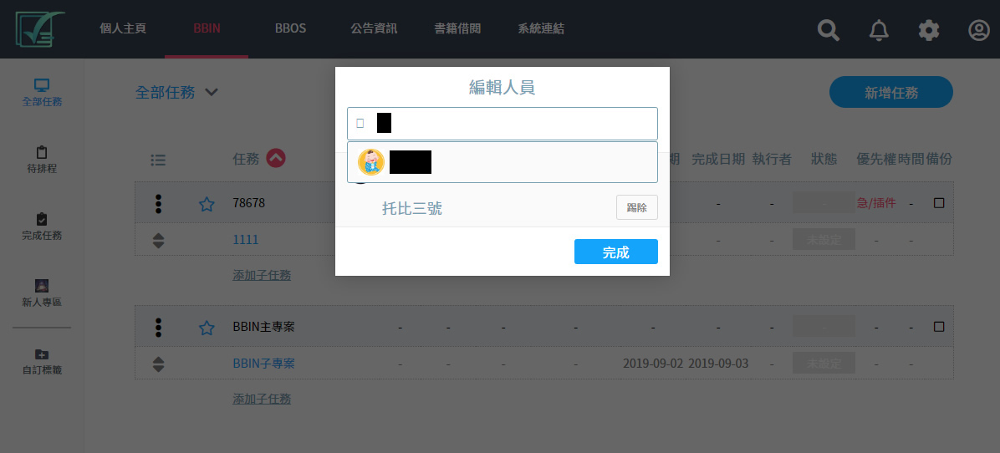

# 前台

http://iconkit.bbinpartner.com/

### 負責部分

設計師出ps設計檔，其他都由我完成 ( 切版、串接資料庫、網站建置、所有功能..等等 )

### 介紹

這是公司的專案管理工具，由於需要使用者登入有關於一些公司機密的部分不方便透漏，所以用截圖的方式呈現

這是個人首頁，你所接手的專案會在這邊呈現

這個月曆是我自己寫的沒加外掛，可以方便給員工查詢自己的專案

每個人可以創建自己的標籤，可以分類自己的專案，主管的話可以用這功能把要執行的員工抓進來只給他們顯現這些專案

每個創建出來的標籤都可以"右鍵點選"修改刪除或是選擇員工進來

點擊任何一個專案進入細節頁

員工管理，這頁面只有管理者看得到

還有些其他功能譬如說資產管理或是書籍借閱等等

